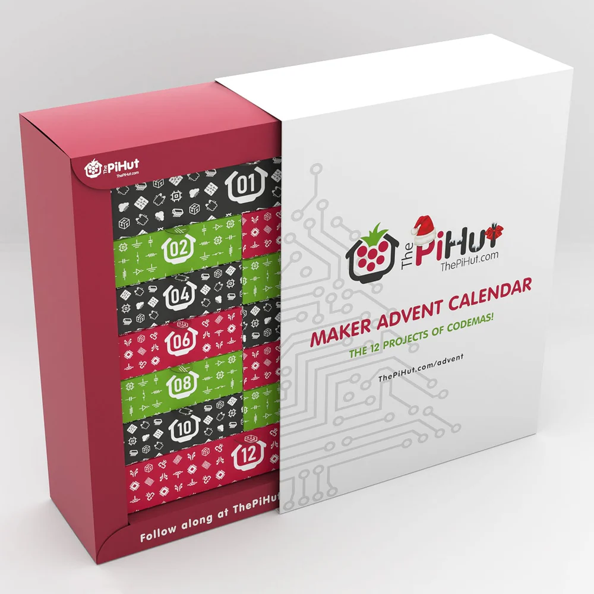
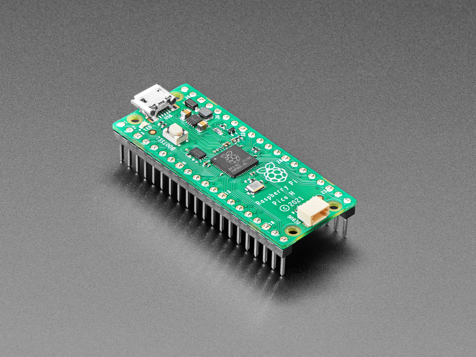
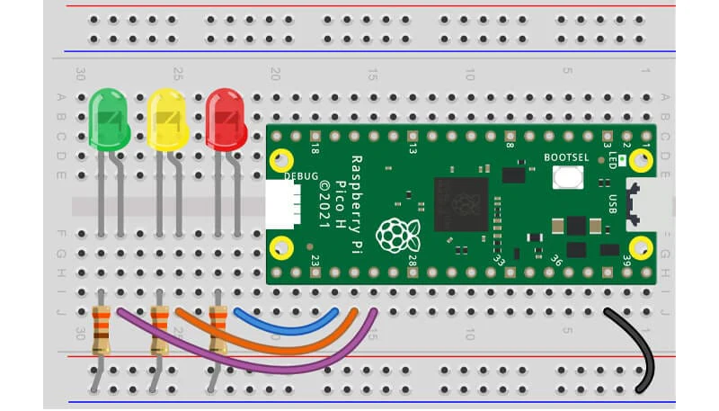
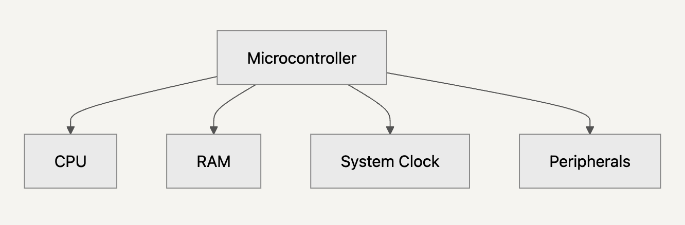
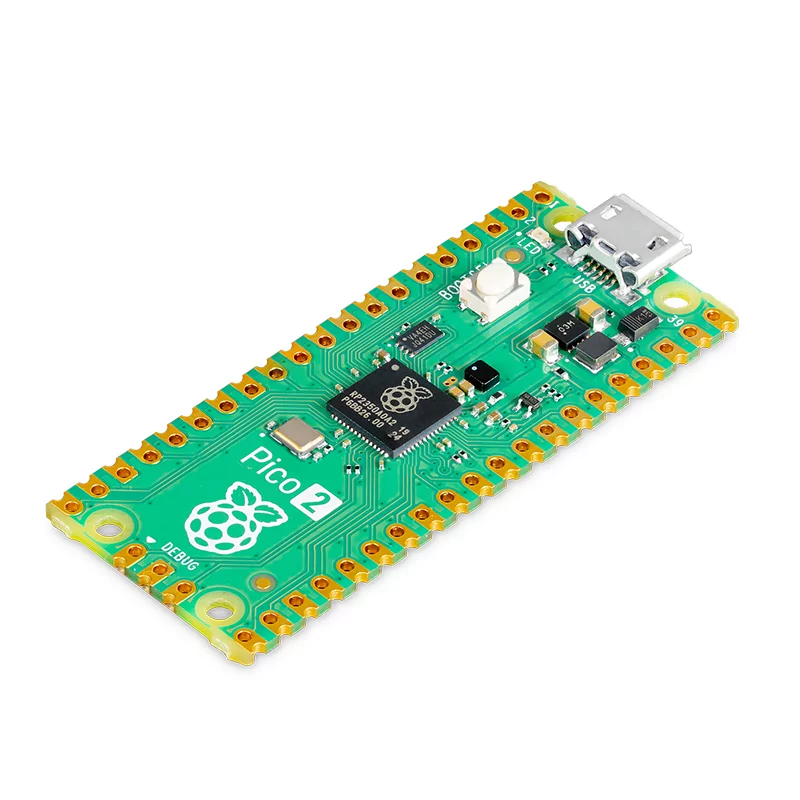
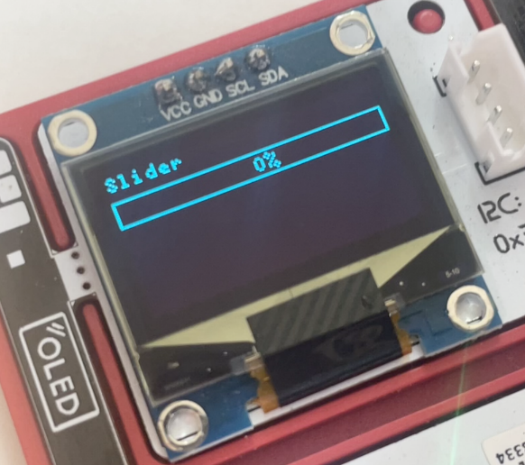

# Flavours of TypeScript

**by tomik**

---

<!-- Kdo z vas nekdy zkousel kodit mikrokontrollery? -->




---



---

```python
# Micropython
from machine import Pin
import time

red = Pin(18, Pin.OUT)
amber = Pin(19, Pin.OUT)
green = Pin(20, Pin.OUT)

red.value(1)
amber.value(1)
green.value(1)

time.sleep(5)

red.value(0)
amber.value(0)
green.value(0)
```

---


---

<div class="columns">
<div>

# Microcontroller basics

</div>
<div>
<p>
A microcontroller is a tiny computer on a single chip, consisting of a CPU, memory, and input/output ports.
</p>
<p>
Runs code directly.
</p>
<p>
Slow but power-efficient.
</p>
<p>
Cheap
</p>
</div>
</div>

---



---



# Popular ones

-   **ESP32**
-   **Raspberry Pi Pico (RP2040)**
-   **Arduino (ATmega328P)**
-   **micro:bit**

---

```python
# Micropython
from machine import Pin
from time import sleep

led = Pin(25, Pin.OUT)

while True:
    led.value(1)
    sleep(0.25)
    led.value(0)
    sleep(0.25)
```

---

## There are more languages to choose from

---

<div class="columns3">
<div>

C

```c
#include "pico/stdlib.h"
#include "pico/binary_info.h"

const uint LED_PIN = 25;
int main() {
    gpio_init(LED_PIN);
    gpio_set_dir(LED_PIN, GPIO_OUT);
    while (1) {
        gpio_put(LED_PIN, 0);
        sleep_ms(250);
        gpio_put(LED_PIN, 1);
        sleep_ms(250);
    }
}
```

</div>
<div>

TinyGo

```go
package main
import (
    "machine"
    "time"
)

func main() {
    led := machine.LED
    led.Configure(machine.PinConfig{
        Mode: machine.PinOutput,
    })
    for {
        led.Low()
        time.Sleep(250 * time.Millisecond)

        led.High()
        time.Sleep(250 * time.Millisecond)
    }
}
```

</div>

<div>

Rust 🤪

```rust
#![no_std]
#![no_main]

use bsp::entry;
use defmt::*;
use defmt_rtt as _;
use embedded_hal::digital::OutputPin;
use panic_probe as _;
use rp_pico as bsp;

use bsp::hal::{
    clocks::{init_clocks_and_plls, Clock},
    pac,
    sio::Sio,
    watchdog::Watchdog,
};

#[entry]
fn main() -> ! {
    let mut pac = pac::Peripherals::take().unwrap();
    let core = pac::CorePeripherals::take().unwrap();
    let mut watchdog = Watchdog::new(pac.WATCHDOG);
    let sio = Sio::new(pac.SIO);

    // External high-speed crystal on the pico board is 12Mhz
    let external_xtal_freq_hz = 12_000_000u32;
    let clocks = init_clocks_and_plls(
        external_xtal_freq_hz,
        pac.XOSC,
        pac.CLOCKS,
        pac.PLL_SYS,
        pac.PLL_USB,
        &mut pac.RESETS,
        &mut watchdog,
    )
    .ok()
    .unwrap();

    let mut delay = cortex_m::delay::Delay::new(core.SYST, clocks.system_clock.freq().to_Hz());

    let pins = bsp::Pins::new(
        pac.IO_BANK0,
        pac.PADS_BANK0,
        sio.gpio_bank0,
        &mut pac.RESETS,
    );
    let mut led_pin = pins.led.into_push_pull_output();

    loop {
        led_pin.set_high().unwrap();
        delay.delay_ms(250);
        led_pin.set_low().unwrap();
        delay.delay_ms(250);
    }
}
```

</div>

</div>

---

But there's one to rule them all

---

<strike>
OSTRAJava

```ostrajava
banik pyco

tryda Ostrava{
    rynek(){
        Konzola.pravit("Toz vitaj") pyco
    }
}

fajront pyco
```

</strike>

---

Today's flavour of TypeScript:

# DeviceScript

## TypeScript for microcontrollers

by tomik

---

<div class="columns">
<div>

## DeviceScript: <br/>TypeScript for microcontrollers

</div>
<div>

-   **Lightweight Runtime**: Optimized for low-power devices.
-   **Hardware Abstraction**: Simplifies interaction with sensors and actuators.
-   **Tooling Integration**: Seamless development experience within Visual Studio Code.

</div>
</div>

---

<div class="columns">
<div>

## Language specifics

</div>
<div>

-   Compiled to bytecode
-   Async/Await, but no Promises
-   No `fuction*` or `yield`
-   Some objects are static and cannot have custom properties
-   No eval
-   [and more...](https://microsoft.github.io/devicescript/language)

</div>
</div>

---

DeviceScript example

```typescript
import { delay } from "@devicescript/core"
import { setStatusLight } from "@devicescript/runtime"

while (true) {
    await setStatusLight(0xffffff)
    await delay(250)
    await setStatusLight(0x000000)
    await delay(250)
}
```

---

## It supports JSX!

<div class="columns">
<div>



</div>

<div>

```typescript
pot.reading.subscribe(async (pos: number) => {
    await renderOnImage(
        <HorizontalGauge
            y={12}
            width={image.width}
            height={12}
            value={pos}
            showPercent={true}
        />,
        image
    )
    await ssd.show()
})
```

</div>
</div>

---

# Let's check it out live

---

<div class="columns">
<div>

# Cool projects

\*Not in devicescript, but still cool

</div>

<div>

-   [pico GameBoy\*](https://github.com/YouMakeTech/Pico-GB)
-   [It can run Doom\*](https://github.com/kilograham/rp2040-doom)
-   IOT integrations (weather sensors etc.)

</div>
</div>

---

# When to use DeviceScript

-   Prototyping
-   Hobby projects
-   You have compatible hardware
-   You don't like Python :)

---

# Limitations

-   Only ESP32 and Raspberry Pi Pico are supported
-   Only ESP32 is fully supported (no TLS for pico W)
-   Devtools quirks
-   Is it still alive? Last release was a year ago 🤔

---

# That's all, folks!
